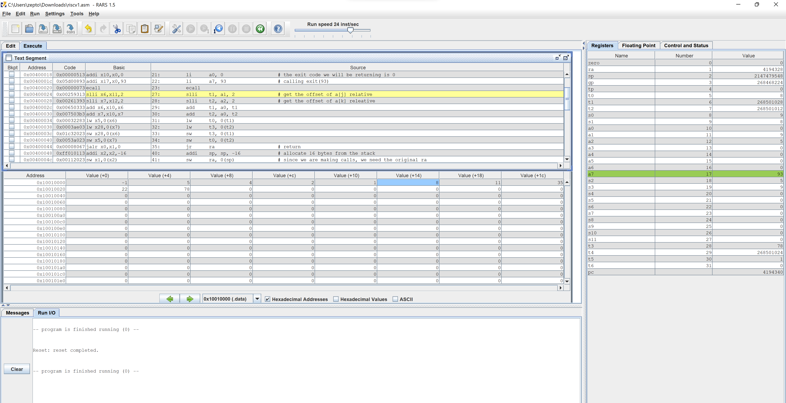

# Lab 1 Report

*ZHOU, Yixiang*

*04/02/2022*

**You can find detailed comments in the code files, so I will skip explaining the expected outcome of each instruction here.**

## Lab 1-1

It was relatively straightforward.

  

## Lab 1-2

We want to implement a function that takes an array and the position of a pivot and rearrange the elements in this array based on their magnitude to the provided pivot.

I translated the provided pseudo code into RISC-V assembly, with some extra steps. Notice that the pseudo code assumed the pivot location being the end of the array, while this task needs the support for arbitrary location. Hence, we move the pivot to the end of the array before the rearrangement process, preventing the tedious matter of keeping track of the changing location of the pivot itself.

## Lab 1-3

Here we use our previous work of array partitioning, yet this time to remove the support for arbitrary pivot location. 

Since I decided to use the same algorithm as in Lab 1-2, the problem emerged as the interval in the array to be sorted does not necessarily start from the beginning. Yet, my algorithm is not able to handle this situation. To fix the problem, I offset the array memory address by the start of the interval and un-offset the return value of the function.

The recursive call stack is shown in the figure above.

> Reference: TextBook -Computer Organization and Design_ The Hardware Software Interface [RISC-V Edition]