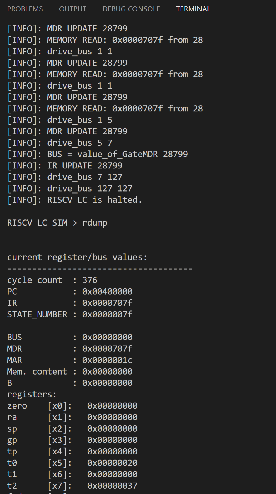
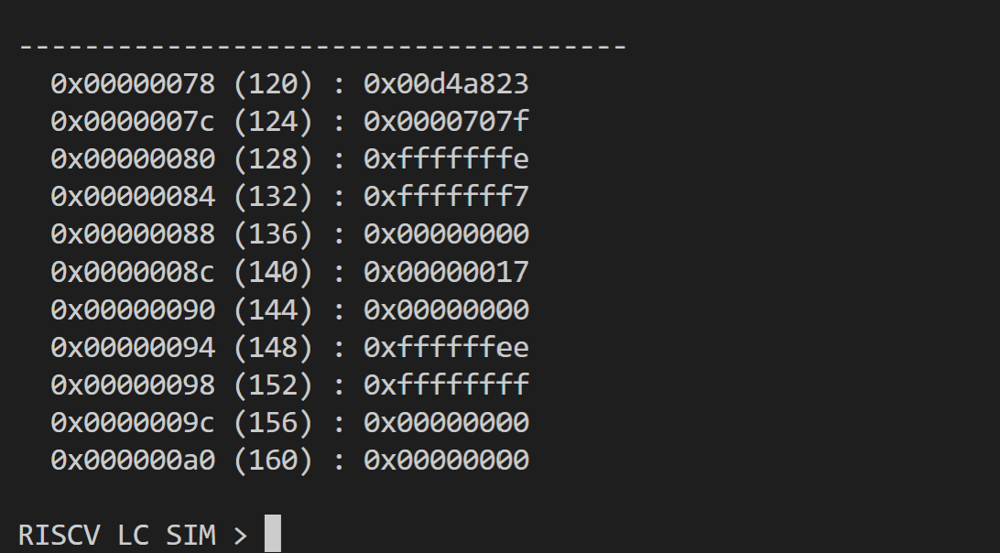

# CENG3420 Lab 3 Report
*ZHOU, Yixiang*
*05/05/2022*

## Overview

This lab is, again, a tedious simulation of the working principle of RISC-V processors. Some of the function implementations are vigorous at first, but with some digging, they turned out to be quite straight forward.

### Note

State 102 provided in file fsm.pdf is incorrect which caused a bit of trouble when finishing `uop`; it should be `PC<-rs1+imm`.

Pre-compiled binaries do not work in my WSL2 setup and I'm both too consumed and lazy to fix it or move my development to Windows. Instead of ultilising the binaries, I finished all sections of the lab and compiled them altogether for debugging.

## Lab 3-1

Nothing too exciting here. Basically transcribing `fsm.pdf` and `riscv-lc.pdf` into binary representation with the help of the Control Signal Table. The `zero register` is implemented by setting the register to 0 at the beginning of each cycle.

## Lab 3-2

Memory operations are nothing new compared to what we've done in the last lab. The output of `datasize_mux` needs some extra attention but nothing too hard.

For the function `latch_datapath_values`, again, it's just directly copying the data path from the `riscv-lc.pdf`.

## Lab 3-3

One thing I almost screwed up and costed me a lot of time to find out: I need to add a break in each case of the switch statement.

## Screenshots

